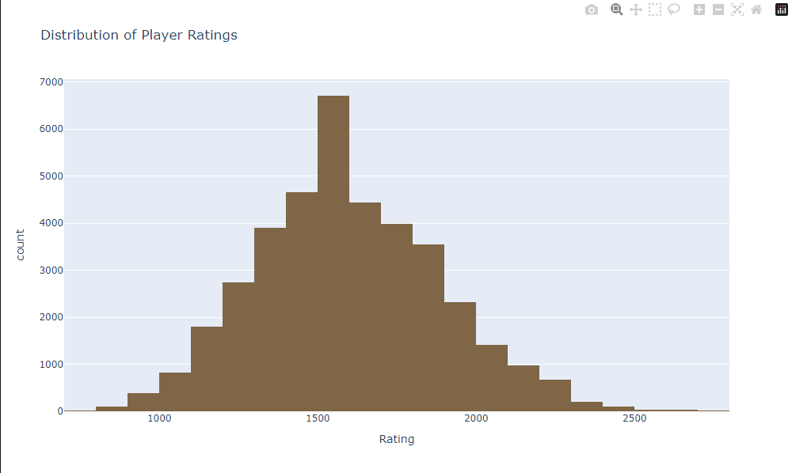

# Análise de Partidas de Xadrez (Lichess)

## Visão Geral
Este projeto realiza a limpeza e análise de dados de partidas de xadrez coletadas do site Lichess.org. O objetivo é explorar as características das partidas e identificar os fatores chave que influenciam os resultados dos jogos, com foco em entender as relações entre as classificações dos jogadores, o tempo de jogo e as decisões estratégicas.

  <!-- Adicione uma imagem relevante do seu projeto aqui -->

## Tecnologias Utilizadas
- Python
- Jupyter Notebook
- Pandas, NumPy
- Matplotlib, Plotly

## Dataset
### Fonte
- [Kaggle: Lichess Dataset](https://www.kaggle.com/datasets/datasnaek/chess/data)

### Descrição dos Dados
O dataset contém aproximadamente 20.000 partidas de xadrez com as seguintes características:

- `id`: ID da Partida
- `rated`: Partida Ranqueada (Sim/Não)
- `created_at`: Hora de Início
- `last_move_at`: Hora de Término
- `turns`: Número de Movimentos
- `victory_status`: Status da Partida
- `winner`: Vencedor
- `increment_code`: Incremento de Tempo
- `white_id`: ID do Jogador Branco
- `white_rating`: Rating do Jogador Branco
- `black_id`: ID do Jogador Preto
- `black_rating`: Rating do Jogador Preto
- `moves`: Todos os Movimentos em Notação Padrão de Xadrez
- `opening_eco`: ECO da Abertura (Código Padronizado para cada abertura)
- `opening_name`: Nome da Abertura
- `opening_ply`: Número de Movimentos na Fase de Abertura

## Estrutura do Projeto
1. **Importação de Bibliotecas**: Importação das bibliotecas necessárias para o projeto.
2. **Carregamento e Visualização dos Dados**: Leitura do dataset e visualização inicial dos dados.
3. **Pré-processamento dos Dados**: Limpeza e preparação dos dados para análise.
4. **Análise Exploratória dos Dados (EDA)**: Análise gráfica e estatística das características dos dados.

## Notebooks
### 1. Limpeza de Dados (`1-data_cleaning.ipynb`)
- **Objetivo**: Limpar e preparar os dados para a análise.
- **Principais Tarefas**:
  - Importação das bibliotecas necessárias.
  - Carregamento e visualização inicial dos dados.
  - Limpeza e tratamento dos dados ausentes ou inconsistentes.

### 2. Análise Exploratória (`2-eda.ipynb`)
- **Objetivo**: Explorar os dados limpos e identificar padrões e insights.
- **Principais Tarefas**:
  - Análise gráfica e estatística das características dos dados.
  - Identificação dos fatores que influenciam os resultados das partidas.

## Insights Importantes
Aqui estão alguns insights importantes obtidos a partir da análise exploratória dos dados:

1. **Ratings**:
   - A maioria dos jogadores está na faixa de 1400-1600 de rating, seguindo uma distribuição normal centrada nessa faixa.
   - O rating é um forte indicador de desempenho; 64% das partidas são vencidas pelo jogador com o rating mais alto. Esse efeito é mais evidente em níveis mais altos de habilidade, alcançando 94% em níveis mestres.

  

2. **Movimentos por partida**:
   - A maioria das partidas termina entre 30 e 70 movimentos.
   - Jogadores de níveis mais altos tendem a ter partidas com mais movimentos, exceto no nível mestre onde o número de movimentos pode diminuir um pouco, mas ainda é mais alto que em níveis avançados.
   - Jogos mais rápidos, como bullet, geralmente têm menos movimentos, enquanto partidas clássicas mostram uma diminuição curiosa no número de movimentos, destacando a gravidade dos erros nesses formatos.

3. **Cor das Peças**:
   - Jogadores que começam com as peças brancas têm uma vantagem, vencendo 5% a mais das partidas, uma tendência observada em todas as classes de habilidade, atribuível à vantagem inicial de jogar primeiro.

4. **Modo de encerramento das partidas**:
   - A maioria das partidas termina por desistência ou cheque-mate.
   - A taxa de empates aumenta conforme a habilidade dos jogadores melhora, especialmente entre os especialistas, refletindo uma maior capacidade de evitar derrotas.

5. **Formato das partidas**:
   - O formato rápido é o mais prevalente entre as partidas.

6. **Aberturas**:
   - As aberturas mais comuns são a "Sicilian Defense" e a "Van't Kruijs Opening".
   - Há vantagens e desvantagens distintas em usar diferentes aberturas, tanto para as peças brancas quanto para as pretas, com algumas aberturas apresentando altos índices de empate.
   - Jogadores de níveis mais elevados tendem a realizar mais lances de abertura, com uma média de 3 para iniciantes e 6.5 para mestres.

## Como Utilizar
### Notebook de Limpeza de Dados
1. Abra o notebook "1-data_cleaning.ipynb".
2. Execute todas as células do notebook para realizar a limpeza e preparação dos dados.

### Notebook de Análise Exploratória
1. Abra o notebook "2-eda.ipynb".
2. Execute todas as células do notebook para realizar a análise exploratória dos dados e obter insights.

## Contribuições
Contribuições são bem-vindas! Se você encontrar algum problema ou tiver sugestões para melhorias, sinta-se à vontade para entrar em contato comigo, abrir uma issue ou enviar um pull request.
